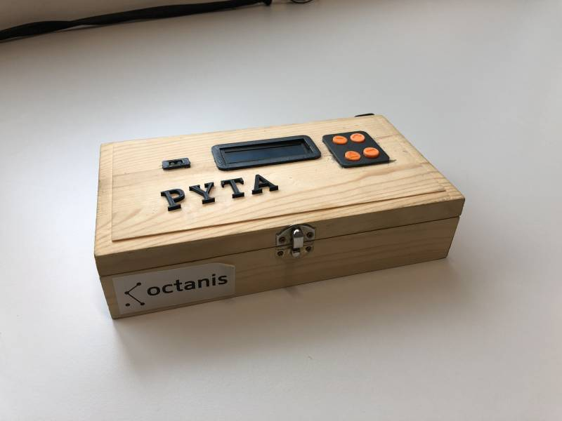

====== PYTA ======

Project Lead: Niccolo Stefanini (ssnnca@gmail.com)

**Overview**

As a student I always try to be productive at my maximum while working in order to study better and have more free time. This project is thus my attempt to create a new way to fight procrastination. This is PYTA: Put Your Telephone Away.

**How it works?**

PYTA aims to create a physical barrier between you and anything that disturbs your life, hijacking your thoughts and concentration. PYTA is a box where you lock whatever disturbs your focus (stop eating cookies, stop waiting for messages) and they will be separated from your hands and your mind for the time you set. PYTA isn't about working more, it is about always giving out your best. Which distractions will you eliminate?

**Project steps**
  - build and develop a prototype for the antiprocrastination box
  - test the concept and get feedback to improve
  - iterate

**Prototypes**
  - PYTA is the first working prototype done, based on the initial concept. It is a wooden box with components attached on the lid controled with an arduino pro mini and designed with 3d printed parts.
  
  
  
  -  PYTA3D aims to be cleaner and lighter than the first one with a 3d printed box and a hidden compartment for electrical component, an oled display and a rotary pushbutton instead of buttons.

**Features**
  *  set lock time from ten seconds to one day
  *  emergency power system and time memory in case of unwanted reset
  *  six month life with a commercial 9 Volts battery
  *  headphone female cable to listen to music while working
  *  easy manufacturing product (3d printable box and easy to solder PCB)
  *  vibration production system to sligthly communicate with the user (for $PYTA^{-1}$) 
  *  phone detecting system  (for new concept) 
  *  phone charging station  (for new concept) 

**Releases**

The project is open-source. You can find code, 3d parts used for fixing and eletrical scheme on github (github/nodiz)

The first prototype is in the Octanis room (in MED 3 225) for those wanting to try the system and may be gather some feedback :) 

**Final notes**

//To conclude I want to specially thanks Beat for all his tuesday-night lessons, Guillaume for his help and ideas and all the Octanis crew for all the support they gave me.//

